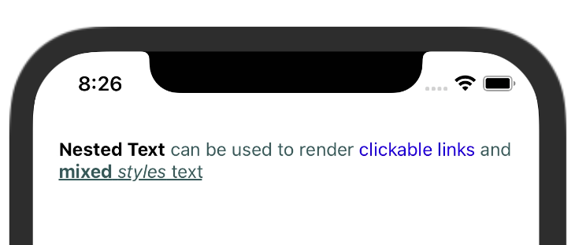

# rn-nested-text

[](https://www.npmjs.com/package/rn-nested-text)

[](https://github.com/youedd/rn-nested-text/main/LICENSE)
[](https://github.com/standard/ts-standard)

A library to simplify rendering [nested text](https://reactnative.dev/docs/text#nested-text) for react native and react native web.

## Install

```bash
npm install rn-nested-text --save
```

or

```bash
yarn add rn-nested-text
```

## Demo
Test it online on [Expo](https://snack.expo.dev/@youedd/rn-nested-text-demo)

## Usage

```JSX
import React from "react";
import { Linking, SafeAreaView } from "react-native";
import NestedText from "rn-nested-text";

// to add or change text's default props
NestedText.defaultTextProps.link = {
  onPress: () => Linking.openURL("https://www.example.com"),
  style: { color: "blue" },
};

const App = () => (
  <SafeAreaView>
    <NestedText
      style={{ color: "#2F4F4F", margin: 20 }}
      textProps={{
        nt: { style: { color: "black", fontWeight: 'bold' } },
      }}
    >
      {
        "<nt>Nested Text</nt> can be used to render <link>clickable links</link> and <u><b>mixed</b> <i>styles</i> text</u>"
      }
    </NestedText>
  </SafeAreaView>
);

export default App;
```


## Props

| Prop      |     Default      |            Typ            | Description                               |
| :-------- | :--------------: | :-----------------------: | :---------------------------------------- |
| children  |        -         |          string           | A nested text string                      |
| textProps | DefaultTextProps | Record<string, TextProps> | Object containing nested texts properties (Optional) |

The NestedText component also supports [React Native Text Props](https://reactnative.dev/docs/text#props).

## Default text props
The library provides the default text props below 

```JSX
{
  i: {
    style: {
      fontStyle: 'italic'
    }
  },

  u: {
    style: {
      textDecorationLine: 'underline'
    }
  },

  b: {
    style: {
      fontWeight: 'bold'
    }
  }
}
```
The static object NestedText.defaultTextProps is exposed to add or change the default props.

```JSX
import NestedText from "rn-nested-text";

// to add or change text's default props
NestedText.defaultTextProps.link = {
  onPress: () => Linking.openURL("https://www.example.com"),
  style: { color: "blue" },
};
```

